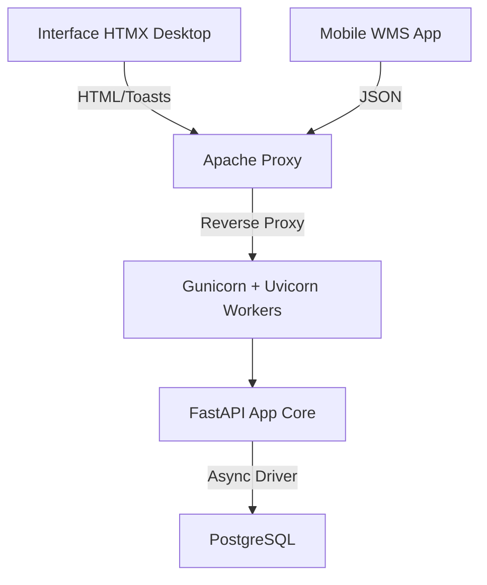

# Ficha Técnica

**Projeto**: GesCol - Sistema de Gestão de Coletores e Colaboradores  
**Versão**: 2.2.0  
**Mantenedor(es)**: Equipe de Engenharia / Magalu Style  
**Última Atualização**: Abril / 2026

## 🎯 Objetivo e Escopo Funcional
O GesCol gerencia a atribuição de equipamentos logísticos. O sistema abrange desde o CRUD de cadastros até dashboards analíticas e APIs REST para integração mobile.

## 🏗️ Arquitetura Resumida
Utiliza uma arquitetura híbrida (HTMX + SSR) com suporte a APIs JSON (v1).

## 📦 Dependências Críticas
- `fastapi`: Core do sistema.
- `sqlalchemy[asyncio]`: Persistência assíncrona.
- `slowapi`: Proteção de borda (Rate Limiting).
- `gunicorn`: Servidor de produção robusto.

## ⚙️ Requisitos Mínimos
- Linux (Debian/Ubuntu/WSL2).
- Python 3.10+.
- Postgres 14+ e Apache2.

## 📝 Changelog / Notas de Versão
- **v2.2.0 (Atual)**
  - ✨ Nova arquitetura de Setup: Scripts `setup.sh` e `initial_run.sh` interativos.
  - 🛠️ Inclusão de `make init` para configuração simplificada de banco de dados.
  - 🔒 Hardenização de `.gitignore`: Garantindo que migrations e configurações de servidor sejam versionadas.
- **v2.1.0**
  - Integração do Gunicorn para gestão Multi-Core.
  - Implementação OOB `[hx-swap-oob]` para Toasts de erro.
  - Mitigação de Força bruta via limites `slowapi`.
- **v2.0.0**
  - Otimização de consultas SQLAlchemy com `joinedload`.
  - Refatoração de segurança por "Filial / CD".
