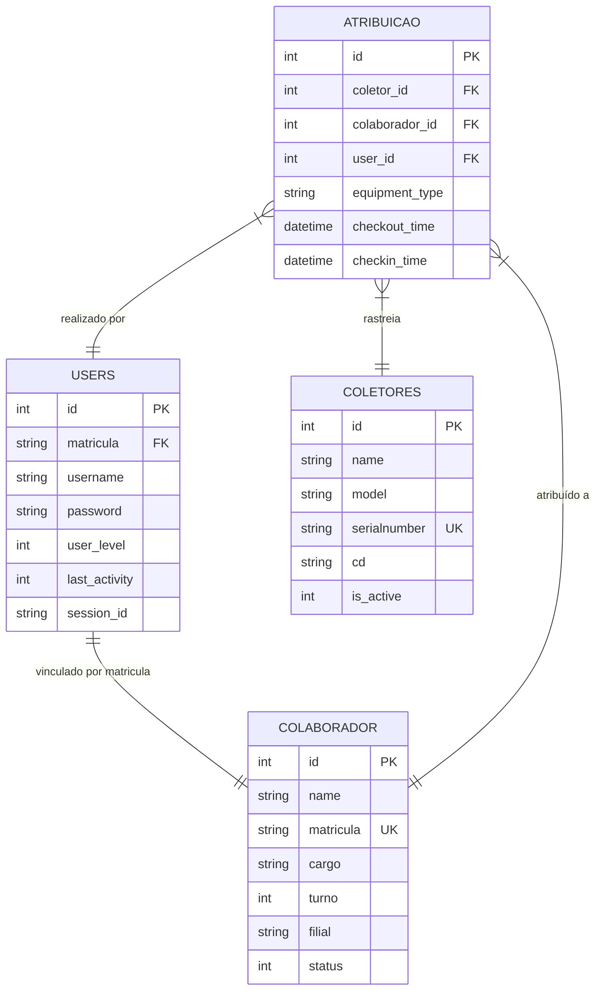

# Documentação do Banco de Dados

O GesCol utiliza um banco de dados **PostgreSQL** com acesso assíncrono para gerenciar usuários, colaboradores e o rastreamento de equipamentos.

## 🏗️ Diagrama de Relacionamentos (ERD)

## 📋 Detalhamento das Tabelas

### 1. `users`
Armazena as credenciais de acesso ao sistema e níveis de permissão.
- **Níveis de Acesso**: 1 (User), 2 (Leader), 9 (Admin), 10 (SuperAdmin).
- **Restrição**: O campo `matricula` vincula o usuário a um colaborador real para determinar sua filial de atuação.

### 2. `colaborador`
Cadastro de funcionários que podem receber equipamentos.
- **Filial**: Campo fundamental para o filtro de segurança horizontal.
- **Matrícula**: Identificador único utilizado para integrações e login.

### 3. `coletores`
Cadastro físico dos coletores e equipamentos de dados.
- **CD**: Representa o Centro de Distribuição/Filial onde o equipamento reside.
- **SerialNumber**: Garantia de unicidade física do hardware.

### 4. `atribuicao`
Tabela de log e estado atual de empréstimos.
- **Ciclo de Vida**: Uma linha com `checkin_time` nulo indica um equipamento atualmente "em posse" do colaborador.
- **Equipment Type**: Diferencia coletores de outros periféricos (impressoras, voz, etc).

## 🔒 Segurança e Multi-tenancy
O sistema implementa **Multi-tenancy Geográfico**. Usuários de nível < 10 (is_cd_restricted) só conseguem visualizar e manipular dados onde `colaborador.filial` ou `coletores.cd` coincidem com o CD do usuário logado.
